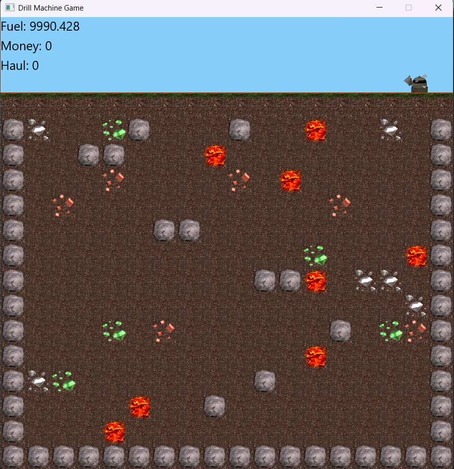

# Drill Machine Game

This is a JavaFX-based mining game inspired by **Motherload**, where the player controls a drill machine to collect valuable minerals and gems while managing fuel levels and avoiding dangerous obstacles.

## 📖 Project Description

In Drill Machine Game, your objective is to collect as much money as possible by mining randomly generated underground resources before your machine runs out of fuel or encounters hazardous elements like lava. The game includes gravity, fuel depletion mechanics, and a variety of underground elements, providing a dynamic and challenging gameplay experience.

## 🕹️ Game Mechanics

### Elements:
- **Drill Machine**: Controlled using arrow keys, it can drill into soil and collect valuables.
- **Underground Elements**:
  - **Soil**: Can be drilled, consumes fuel, but yields no money or weight.
  - **Valuables**: Collectible minerals and gems, which add weight and provide money.
  - **Boulders**: Indestructible obstacles that form the underground boundaries.
  - **Lava**: Hazardous areas that end the game upon contact.

### Rules:
1. The machine loses fuel continuously, with significant loss during drilling.
2. Collecting valuables increases money but also adds weight.
3. Drilling into lava causes immediate game over.
4. Fuel depletion ends the game, displaying the total money collected.
5. Gravity applies: the machine falls if no element is underneath it.
6. The machine can only fly up in empty spaces and cannot drill upwards.

## Screenshot 

